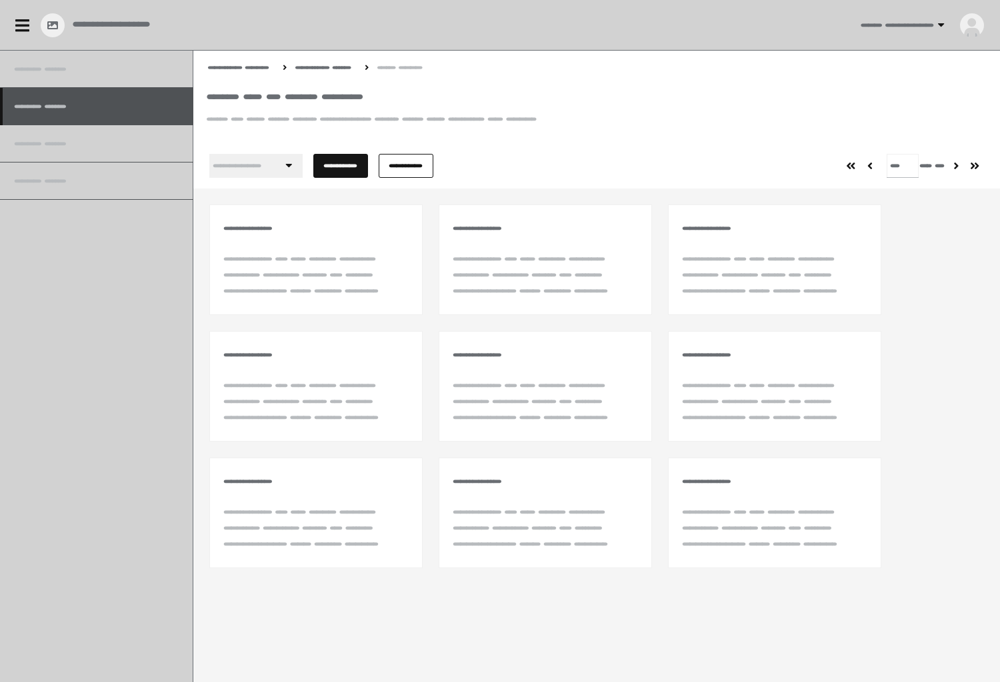
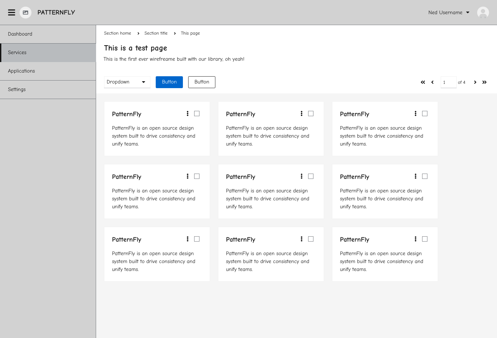
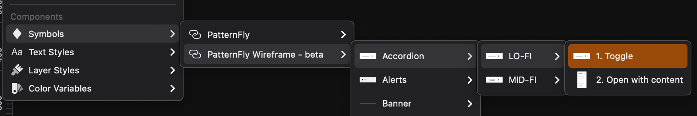
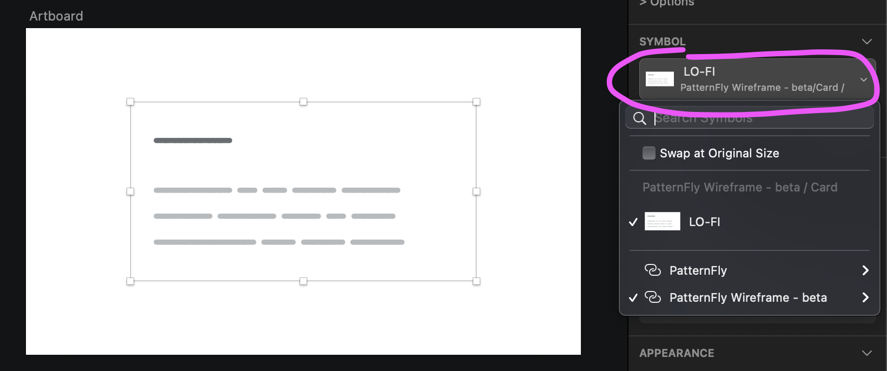
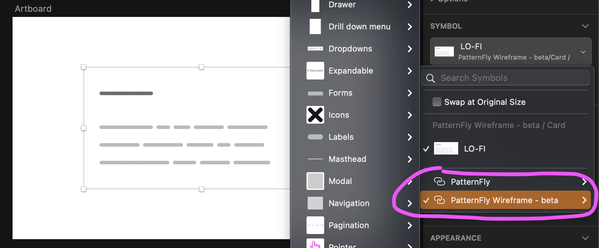
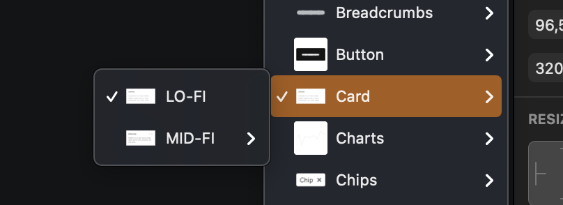
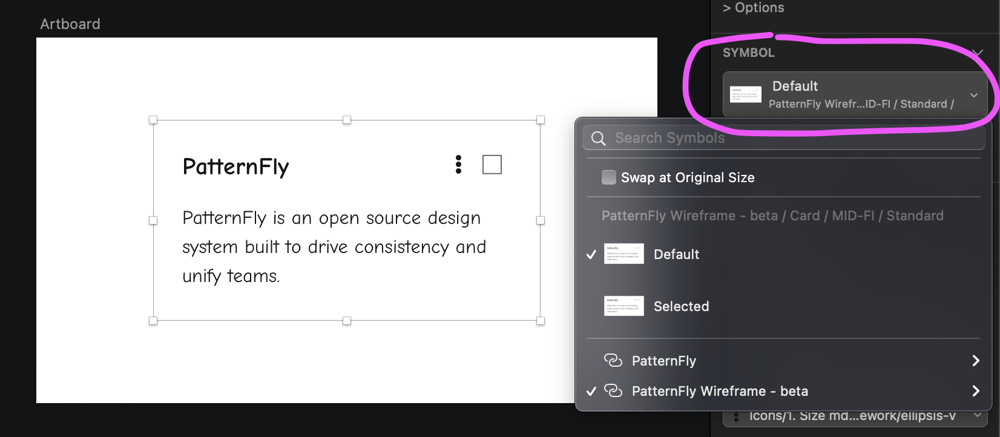
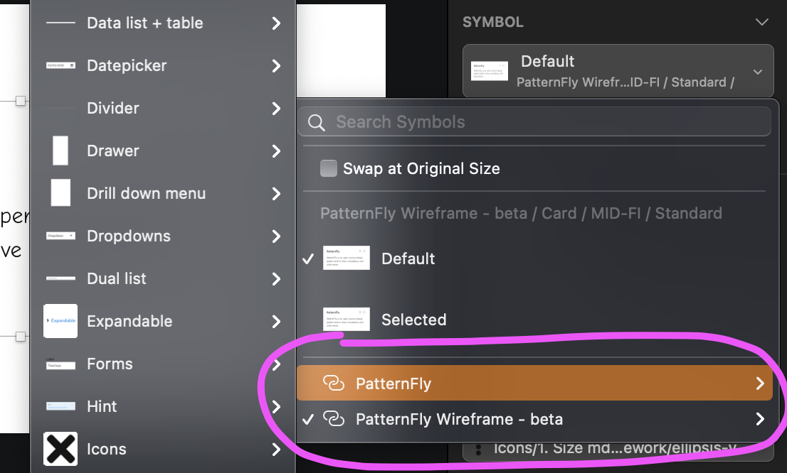
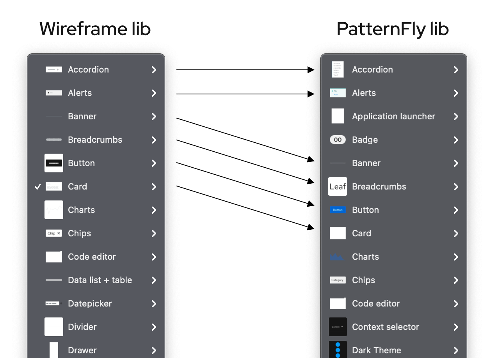
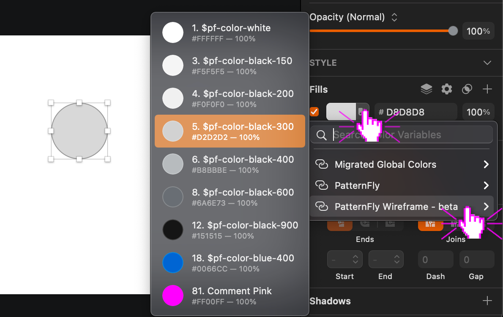

# Wireframe kit
The PatternFly (PF) Wireframe library for Sketch is the perfect companion to the PatternFly design kit. If you’re familiar with designing mockups with the PF design kit you'll be able to adjust quickly to designing wireframes with the PF Wireframe library.
Ultimately, the PF Wireframe library will serve as a tool to speed up your ideation process and allow you to design and iterate designs more quickly before upgrading them to high fidelity. 

It includes: 
* A Wireframe library that allows you to design and iterate designs more quickly before upgrading them to high fidelity. Hosted on Sketch Cloud [here](https://www.sketch.com/s/97d92966-7ad7-4207-a381-48fda3c080f8).
* A Wireframe template file that provides examples of low and medium fidelity components in a context. Hosted on Sketch Cloud [here](https://www.sketch.com/s/0af9fc12-7b9e-49c1-8d36-a6a62385a413).

## Low fidelity vs Medium fidelity
If we take the PF design kit as a reference of a tool used to produce high fidelity artifacts, then the PF Wireframe library will provide resources to produce artifacts at two different lower fidelity levels:

### Low fidelity (LO-FI)
Used during the very early stages of the design process when only basic product requirements are available, this kind of wireframe allows you to try out layout options and aligning stakeholders on information architecture and design vision. They can also be utilized to help visualize user workflows.
Specifications:
* Skeleton-style components
* Block font placeholder text
* Eventually mix with mid-fidelity components if a specific focus is needed for the review

### Medium fidelity (MID-FI)
These kinds of wireframes are the most common and are usually the starting point for most designers. At this stage of the process, product requirements are more mature and include not only information architecture but also user interactions and basic content. These wireframes serve the purpose of getting the closest to the final functional requirements without wasting time on unnecessary details. This is the space where designers would probably iterate the most, in order to get quick feedback on UI composition and content before moving on to the high fidelity mockups. Specifications:
* Grey scale
* Only most basic UI component states (eg. default, disabled)
* Script style font
* Highlighted call to actions

## How to start
### Download Wireframe font
The PatternFly Wireframe kit uses [Flow](https://fonts.google.com/specimen/Flow+Circular) for LO-FI components and [Comic Neue](https://fonts.google.com/specimen/Comic+Neue#standard-styles) for MID-FI components. Both font families are released under a OFL (Open Font License) license. 

### Download the template file 
* Access the PatternFly Wireframe template file on Sketch cloud [here](https://www.sketch.com/s/0af9fc12-7b9e-49c1-8d36-a6a62385a413).
* Click Download in the document menu to download the file locally
* **OPTIONAL:** Open the `PatternFly Wireframe template.sketch` file, then click File → Save as template. (This would allow you to create a new file from the “New from Template” menu)

### Add the library
* Access the PatternFly Wireframe library on Sketch cloud [here](https://www.sketch.com/s/97d92966-7ad7-4207-a381-48fda3c080f8).
* Click Add Library in the document menu to add the library to Sketch.
* You'll be prompted with a modal that will either redirect you to Sketch or ask you to Launch Sketch.
Sketch will automatically open up the preferences window pane and display the library installation progress.

## How to use
### Use the library
In order to speed up your process, we highly suggest to start creating your wireframes from the [Wireframe template file](https://www.sketch.com/s/0af9fc12-7b9e-49c1-8d36-a6a62385a413). You can then eventually customize your screens to fit your product requirements by using the individual symbols provided with the [Wireframe library](https://www.sketch.com/s/97d92966-7ad7-4207-a381-48fda3c080f8). 

### Navigating the symbol library
* The architecture of the library menu has been implemented to be the most consistent with the menu of the current “hi-fi” PatternFly library and to make it the easiest to
    *  Locate components
    * Swap components (for example, when turning a lo-fi screen into a mid-fi screen)
* The menu follows the structure below
    * `Component family`
        * `Fidelity (LO-FI/MID-FI)`
            * `Variants`
                * `State (MID-FI components only)`

### How to switch component fidelity or state
The main idea behind the library is to offer designers a way to move along the different phases of the design process by prototyping from low to high fidelity using the same Sketch file.
For this reason, we tried to make it as easy as possible to swap your components, so that for instance, you can:
* Start with a lo-fi screen, for instance, to get buy-in from stakeholders on the layout and general design direction
* Upgrade the lo-fi components to mid-fi, where you can start defining some basic interactions, states, and collaborate on microcopy - ideally, this is the level of fidelity where you will iterate the most
* When stakeholders agree on the designs, upgrade them to the current “hi-fi” PatternFly Sketch library for handover to the engineering team.

### LO-FI to MID-FI
* Select the component you want to swap
* Click on the “SYMBOL” dropdown menu located in the right-hand sidebar
  
* Hover your cursor over “PatternFly Wireframe - beta” to display the library menu
  
* Follow the ticks to identify the component family
  
* Select the desired **MID-FI** version of the component

### MID-FI component state
* Select the component you want to swap
* Click on the “SYMBOL” dropdown menu located in the right-hand sidebar
  
* If available, select a different state for the component (if the state you are looking for is not available and you feel like it is needed, please report it to us!)

### MID-FI to HI-FI (current PF Sketch library)
* Select the component you want to swap
* Click on the “SYMBOL” dropdown menu located in the right-hand sidebar
* Hover your cursor over “PatternFly” to display the library menu
  
* Follow the similar grouping pattern to identify the component family
  
* Identify the component you want to upgrade to **HI-FI**
* Identify and select the component state, if any is available

### Text styles & color variables
To make the wireframe creation process as quick and seamless as possible, we assigned all component colors and text to variables.
If you need to create any custom symbols and/or content, you can use the provided styles to have a consistent look and feel.

**Text styles**
* LO-FI
    * **Flow (Circular) 16** - use these text styles for regular content
        * Dark grey variant - labels, highlights…
        * Light grey variant - body text
    * **Flow (Circular) 24** - use this text style for headings

* MID-FI
    * **Liberation Mono (Regular) 16** - use this text style for everything code related
    * **Comic Neue** - use these text styles for any text content. Please follow each text style name for an indication of when to use it.
    * **Comment** - use these text styles to add any comments for your stakeholders to the designs

**Color variables**
* Preferably use the provided color variables when assigning colors to custom shapes.

## Report issues
Are you finding any bugs while using the library (eg. symbol not resizing correctly)? Or did you maybe encounter any usability issues (eg. can’t switch fidelity, overrides not working)? Or maybe you would like a new component or design pattern to be added to the library and/or template file?
Please do the following:
* Go to [Issues · patternfly/patternfly-design-kit](https://github.com/patternfly/patternfly-design-kit/issues)
* Open/create a new issue
* Make sure to ping `@cntlsn` (Alessandro Contini) in the description of the issue

## Share your feedback
Do you have any feedback about your experience creating wireframes with the PF Wireframe library? For example:
* Do you create wireframes at both fidelities? If not, which one do you default to the most?
* When designing wireframes, do you prefer to have ready-made “complex” components with fewer customization options, or would you rather have simple components to manually assemble into complex ones?
* Do wireframes work better for stakeholder review, and do stakeholders realize it’s a low-fidelity version of mockups? Do stakeholders feel more comfortable sharing feedback?
If you want to share similar feedback please submit the following [survey](https://forms.gle/dEFxamLHFRxBvZRN8) – It shouldn’t take more than 10-15 minutes to complete the survey.
